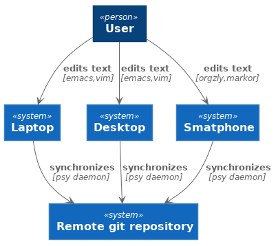
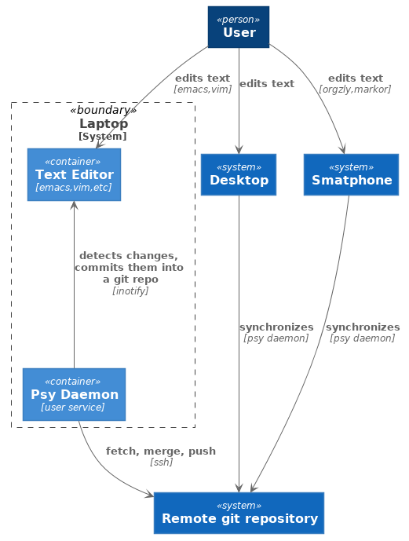
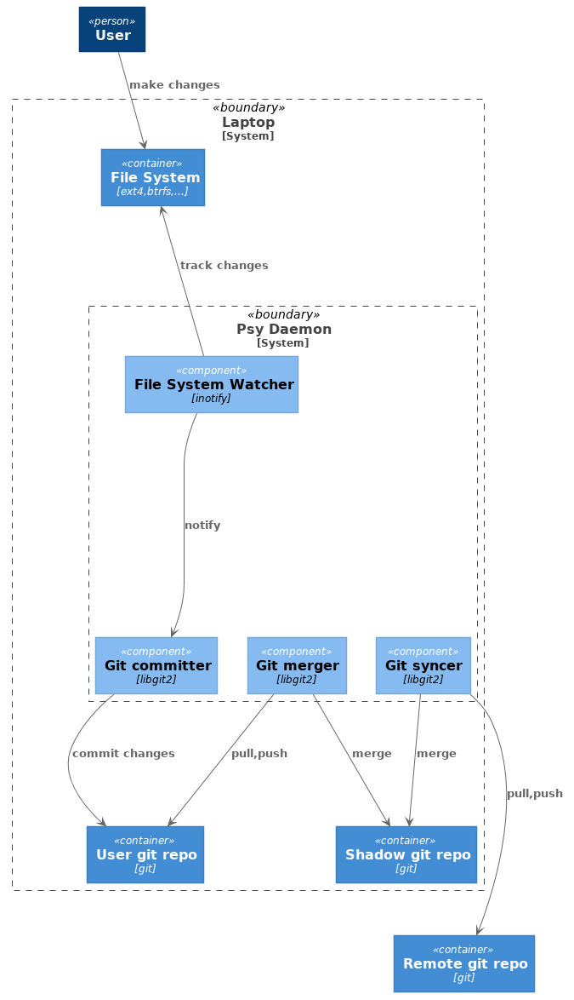

# Plain Sync Daemon (Psy Daemon)

Plain Sync Daemon will be a tool to synchronize plain text files
across several computers that uses git repositories as a storage.

Status: does not work yet.

## Why a new tool?

The majority of the existing file synchronization tools are generic
purpose tools, so they should perform strongly on binary data. But
this doesn't let them take full advantage of some files being in plain
text. In fact history is sometimes even more important than the actual
data. Well, you don't need to browse the history every day, but when
you need, you usually need it badly. Even if the existing tools
provided full history of everything, it would have been hard to learn
how to explore that history if you only need it occasionally. Long
story short there is one tool that is great at going back in time and
that is at everyone's fingertips - it's [git][git]. Git is also much
better at merging files changed by 2 parties comparing to other tools
that normally accept one of the copies as the master one.

Using git manually for saving history of individual files is
tedious. It's also easy to forget to commit something important or one
might forget to push data to remote. In fact what the author wants is
a tool that automatically commits all the detected changes and
synchronizes local and remote repositories frequently (once every 3-5
minutes).

Additionally the author has great experience with [password store][8]
that uses git for managing the data. It is trivial to build a mental
model of this system, it's extremely easy to browse or manipulate
history when needed. It looks like building concurrent software on top
of git might be a good idea.

[git]: https://git-scm.com/

## Design

The diagrams below follow [C4 model][c4] notation. The diagrams are
built using [PlantUML][puml].

[c4]: https://c4model.com/
[puml]: http://plantuml.com/

### Context Diagram (C4 model)

### Container Diagram (C4 model)

### Component Diagram (C4 model)

